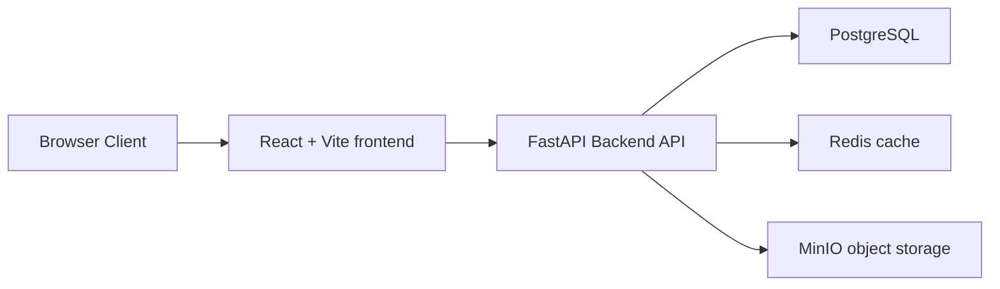
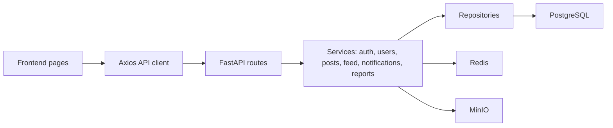
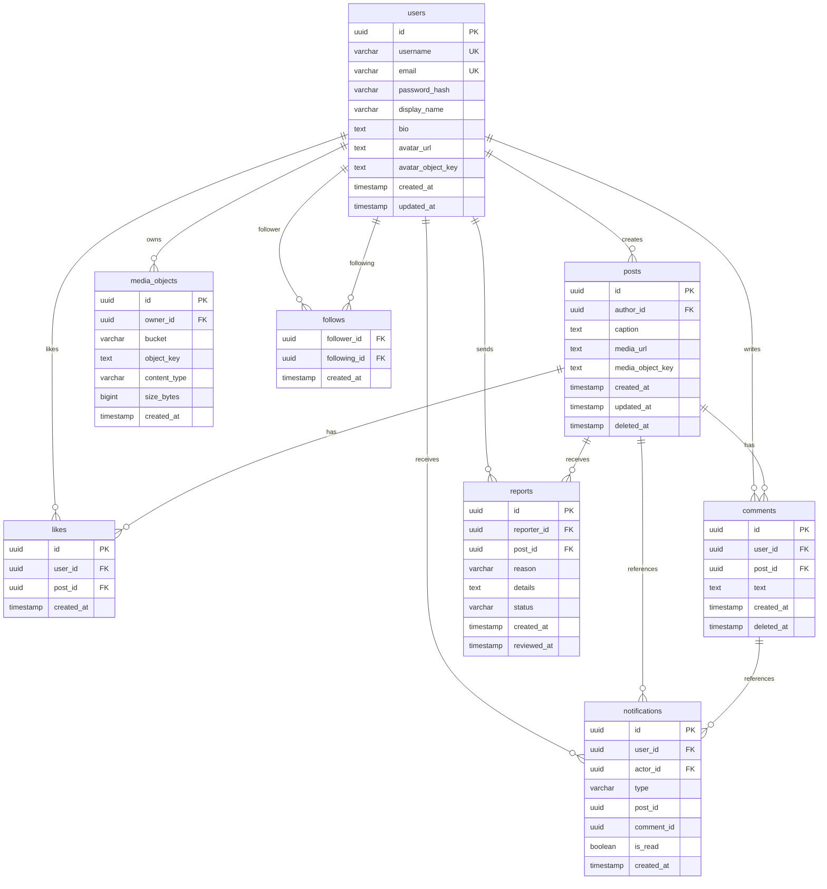

# socialgram / bubbl

**bubbl** — учебный архитектурный прототип социальной сети в стиле iOS-like liquid glass. Техническое название проекта: **socialgram**.

Проект создан для предмета «Архитектура программных систем»: он показывает рабочую связку frontend, backend API, PostgreSQL, Redis, MinIO, Docker Compose, Swagger, seed-данные, pytest и k6.

## Архитектура

Backend реализован как modular monolith на FastAPI: HTTP routes принимают запросы, services содержат бизнес-логику, repositories работают с PostgreSQL, schemas описывают DTO, models описывают SQLAlchemy-модели.

Состав сервисов:

- `frontend` — React + Vite + TypeScript, интерфейс на русском языке.
- `backend` — FastAPI, SQLAlchemy 2.x, Alembic, JWT, MinIO, Redis.
- `postgres` — транзакционные данные.
- `redis` — кеш read-heavy ленты.
- `minio` — объектное хранилище изображений.

Архитектурные решения:

- PostgreSQL хранит пользователей, посты, подписки, лайки, комментарии, уведомления и metadata медиа.
- MinIO хранит реальные изображения, в БД не кладутся BLOB-файлы.
- Redis используется для кеша ленты.
- Лента реализована как fan-out on read.
- Уведомления создаются синхронно в MVP; при росте их можно вынести в очередь.
- Для x10 нагрузки нужны CDN для медиа, feed cache, read replicas, partitioning/sharding posts/likes/comments, async workers, Kafka/RabbitMQ и горизонтальное масштабирование backend.

## Запуск

```bash
docker compose up --build
```

После старта backend автоматически применяет Alembic-миграции и запускает idempotent seed. MinIO bucket `socialgram-media` создаётся init-сервисом.

## Миграции

```bash
make migrate
```

Или напрямую:

```bash
docker compose exec backend alembic upgrade head
```

## Seed

```bash
make seed
```

Seed создаёт 10 пользователей, 32 публикации, подписки, лайки, комментарии, уведомления и загружает SVG-изображения в MinIO. При повторном запуске он не дублирует данные, если пользователь `filipp` уже существует.

Для живой демонстрационной ленты с большим количеством фото есть отдельная команда:

```bash
make seed-heavy
```

Heavy seed скачивает публичный Kaggle dataset `pavansanagapati/images-dataset` через `kagglehub`, создаёт минимум 120 пользователей и 1100 публикаций, заполняет аватары, хештеги, лайки, комментарии, уведомления и демо-жалобы для админ-панели. Если Kaggle временно недоступен, скрипт всё равно заполнит соцсеть fallback-изображениями.

Тестовые пользователи:

| username | email | password | display name |
| --- | --- | --- | --- |
| `filipp` | `filipp@example.com` | `password123` | Филипп |
| `anya` | `anya@example.com` | `password123` | Аня |
| `polinakriv` | `polina@example.com` | `password123` | Полина |
| `sergey.jpg` | `sergey@example.com` | `password123` | Сергей |

## Основные URL

- Frontend: `http://localhost:3000`
- Backend: `http://localhost:8000`
- Swagger: `http://localhost:8000/docs`
- Healthcheck: `http://localhost:8000/api/health`
- MinIO Console: `http://localhost:9001`
- MinIO login/password: `minioadmin` / `minioadmin`
- Админ-панель bubbl: `http://localhost:3000/admin`

## Основные API endpoints

- `POST /api/auth/register`
- `POST /api/auth/login`
- `GET /api/auth/me`
- `GET /api/users/me`
- `PATCH /api/users/me`
- `GET /api/users/{username}`
- `GET /api/users/search?q=`
- `POST /api/users/{user_id}/follow`
- `DELETE /api/users/{user_id}/follow`
- `GET /api/feed`
- `POST /api/posts`
- `GET /api/posts/{post_id}`
- `DELETE /api/posts/{post_id}`
- `GET /api/posts/trends`
- `POST /api/posts/{post_id}/report`
- `GET /api/admin/reports`
- `POST /api/admin/reports/{report_id}/reviewed`
- `POST /api/posts/{post_id}/like`
- `DELETE /api/posts/{post_id}/like`
- `POST /api/posts/{post_id}/comments`
- `GET /api/posts/{post_id}/comments`
- `DELETE /api/comments/{comment_id}`
- `GET /api/notifications`
- `POST /api/notifications/read-all`
- `GET /api/system/stats`

## Backend tests

```bash
make test
```

Или напрямую:

```bash
docker compose exec backend pytest -q
```

## k6 нагрузочные тесты

Перед запуском выполните `make seed`, чтобы пользователь `filipp` существовал.

```bash
k6 run load-tests/k6/smoke.js
k6 run load-tests/k6/planned-load.js
k6 run load-tests/k6/stress.js
k6 run load-tests/k6/x10-load.js
```

Через Makefile:

```bash
make load-smoke
make load-planned
make load-stress
make load-x10
```

# Архитектура socialgram / bubbl

## Бизнес-домены

- Пользователи и профили: регистрация, вход, avatar, bio, публичный профиль.
- Социальный граф: подписчики и подписки.
- Контент: публикации с изображениями и описанием.
- Вовлечение: лайки и комментарии.
- Уведомления: лайк, комментарий, новая подписка.
- Модерация: жалобы на публикации и обработка в админ-панели.
- Поиск: username и display name.
- Админская зона: healthcheck, статистика, жалобы, ссылки на Swagger и MinIO.

## Прикладные домены

Backend построен как modular monolith: внутри одного FastAPI-приложения есть маршруты, сервисы, repositories, DTO-схемы и SQLAlchemy-модели. Такой подход достаточно прост для учебного проекта, но сохраняет границы, которые можно вынести в отдельные сервисы при росте.

## HLD



## LLD



## ER Diagram



## Выбор хранилищ

PostgreSQL выбран для транзакционных данных: пользователи, посты, подписки, лайки, комментарии, уведомления и жалобы требуют уникальности, внешних ключей и консистентности.

MinIO выбран для изображений, потому что BLOB-файлы не должны храниться в PostgreSQL. В базе остаются metadata и object_key, а сами изображения живут в S3-compatible object storage.

Redis используется для read-heavy сценариев. В MVP кешируется лента пользователя с TTL и простой инвалидацией при создании постов, лайках и комментариях.

## Лента

Система считается read-heavy, примерно 20:1 read/write. В MVP реализован fan-out on read: при запросе ленты backend выбирает публикации текущего пользователя и тех, на кого он подписан, сортируя новые сверху. Для учебного прототипа это прозрачно и удобно.

При росте нагрузки можно перейти к fan-out on write: заранее материализовать feed entries при создании поста через очередь событий.

## Bottlenecks

- Подсчёты лайков и комментариев сейчас считаются запросами к БД.
- Fan-out on read может стать дорогим для пользователей с большим числом подписок.
- Уведомления создаются синхронно в HTTP-запросе.
- Media URLs отдаются напрямую из MinIO без CDN.

## Масштабирование x10

- CDN перед MinIO для отдачи медиа.
- Redis feed cache с более точной инвалидацией.
- Read replicas PostgreSQL для read-heavy endpoint.
- Partitioning/sharding таблиц posts, likes, comments.
- Очереди Kafka/RabbitMQ для лайков, уведомлений и fan-out on write.
- Async workers для уведомлений и агрегатов.
- Горизонтальное масштабирование backend за load balancer.
