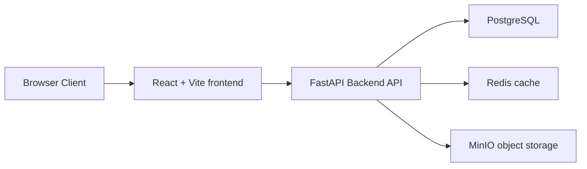
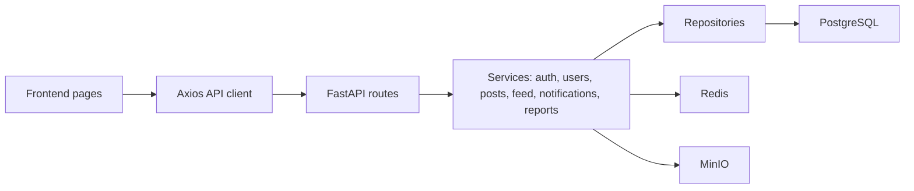
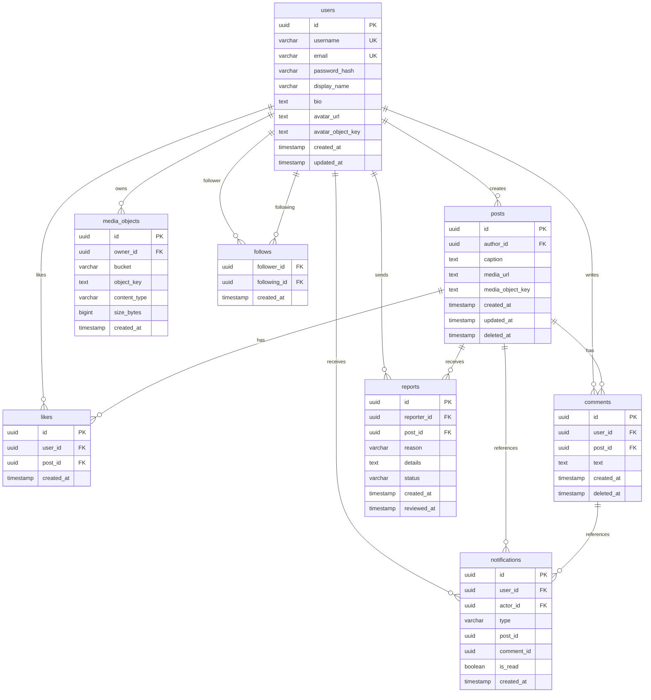

# Архитектура socialgram / bubbl

## Бизнес-домены

- Пользователи и профили: регистрация, вход, avatar, bio, публичный профиль.
- Социальный граф: подписчики и подписки.
- Контент: публикации с изображениями и описанием.
- Вовлечение: лайки и комментарии.
- Уведомления: лайк, комментарий, новая подписка.
- Модерация: жалобы на публикации и обработка в админ-панели.
- Поиск: username и display name.
- Админская зона: healthcheck, статистика, жалобы, ссылки на Swagger и MinIO.

## Прикладные домены

Backend построен как modular monolith: внутри одного FastAPI-приложения есть маршруты, сервисы, repositories, DTO-схемы и SQLAlchemy-модели. Такой подход достаточно прост для учебного проекта, но сохраняет границы, которые можно вынести в отдельные сервисы при росте.

## HLD

## LLD

## ER Diagram

## Выбор хранилищ

PostgreSQL выбран для транзакционных данных: пользователи, посты, подписки, лайки, комментарии, уведомления и жалобы требуют уникальности, внешних ключей и консистентности.

MinIO выбран для изображений, потому что BLOB-файлы не должны храниться в PostgreSQL. В базе остаются metadata и object_key, а сами изображения живут в S3-compatible object storage.

Redis используется для read-heavy сценариев. В MVP кешируется лента пользователя с TTL и простой инвалидацией при создании постов, лайках и комментариях.

## Лента

Система считается read-heavy, примерно 20:1 read/write. В MVP реализован fan-out on read: при запросе ленты backend выбирает публикации текущего пользователя и тех, на кого он подписан, сортируя новые сверху. Для учебного прототипа это прозрачно и удобно.

При росте нагрузки можно перейти к fan-out on write: заранее материализовать feed entries при создании поста через очередь событий.

## Bottlenecks

- Подсчёты лайков и комментариев сейчас считаются запросами к БД.
- Fan-out on read может стать дорогим для пользователей с большим числом подписок.
- Уведомления создаются синхронно в HTTP-запросе.
- Media URLs отдаются напрямую из MinIO без CDN.

## Масштабирование x10

- CDN перед MinIO для отдачи медиа.
- Redis feed cache с более точной инвалидацией.
- Read replicas PostgreSQL для read-heavy endpoint.
- Partitioning/sharding таблиц posts, likes, comments.
- Очереди Kafka/RabbitMQ для лайков, уведомлений и fan-out on write.
- Async workers для уведомлений и агрегатов.
- Горизонтальное масштабирование backend за load balancer.
